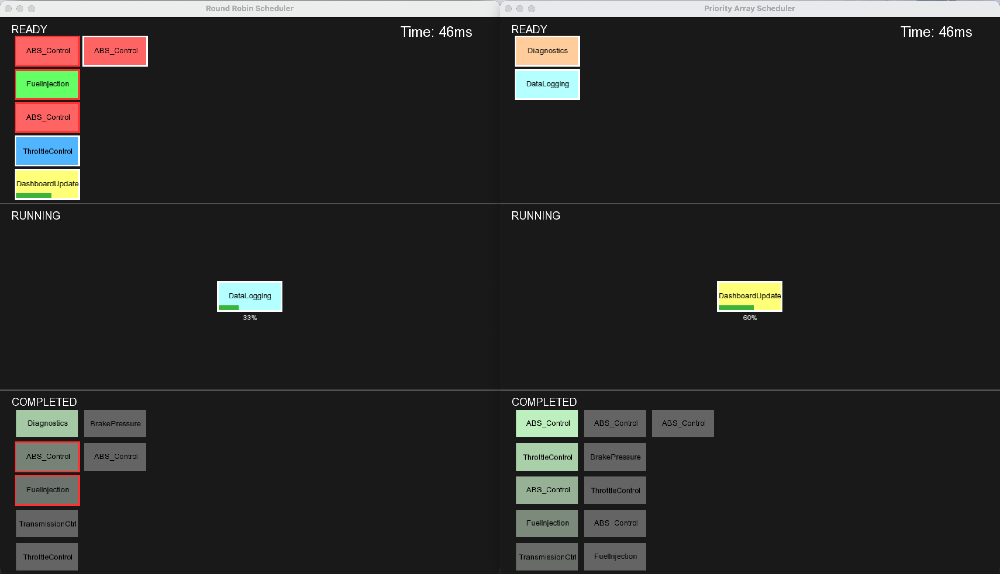

# RTOS Scheduling Suite

The **RTOS Scheduling Suite** is a command-line application used to analyze and compare the behavior and performance of different CPU scheduling algorithms. The project focuses primarily on **preemptive schedulers**, as they are commonly used in real-time operating systems.

The tool allows schedulers to be run under identical simulation parameters and compared using both numeric metrics and optional real-time visualization. Note that task order and density is randomized with each run.


## Implemented Schedulers

- Binary Heap Scheduler  
- Priority Array Scheduler  
- Round Robin Scheduler  
- Shortest Job First (SJF) Scheduler  
- First Come, First Serve (FCFS) Scheduler *(non-preemptive)*


## File Structure

```
rtos-scheduler/
├── assets/
│   ├── Arial.ttf
│   └── Render.png
├── include/
│   ├── BinaryHeapScheduler.h
│   ├── Executable.h
│   ├── FCFSScheduler.h
│   ├── Job.h
│   ├── PriorityArrayScheduler.h
│   ├── RoundRobinScheduler.h
│   ├── Scheduler.h
│   ├── Simulation.h
│   ├── SJFScheduler.h
│   └── Visualization.h
├── src/
│   ├── BinaryHeapScheduler.cpp
│   ├── Executable.cpp
│   ├── FCFSScheduler.cpp
│   ├── Job.cpp
│   ├── main.cpp
│   ├── PriorityArrayScheduler.cpp
│   ├── RoundRobinScheduler.cpp
│   ├── Simulation.cpp
│   ├── SJFScheduler.cpp
│   └── Visualization.cpp
├── .gitignore
├── CMakeLists.txt
└── README.md
```


## Building the Project

This project uses **C++14** and depends on **SFML 2.6.2** for visualization support. The build process is consistent across macOS, Linux, and Windows.

From the project root:

```
cmake -S . -B <build-dir>
cmake --build <build-dir>
```

As long as SFML is installed and available to CMake, the project should compile successfully.


## Usage

Schedulers can be compared using the `-compare` flag:

```
rtosSuite -compare fcfs pa
```

This runs both schedulers under the same simulation conditions and outputs performance metrics for comparison.

Additional options:

```
rtosSuite -compare <first> <second> --simTime <time> --timeStep <step> [--render]
```

### Flags

- `--simTime`  
  Total simulation time in milliseconds (default: `1000000`)

- `--timeStep`  
  Interval at which simulation updates are printed (default: `0`, disabled)

- `--render`  
  Enables real-time visualization using two windows, one per scheduler (default: disabled)

Other commands:
- `-list` — Lists available schedulers
- `-help` — Displays usage information


## Visualization

When the `--render` flag is enabled, the simulation displays two windows visualizing scheduler execution in real time.




## References

- https://www.geeksforgeeks.org/dsa/first-come-first-serve-cpu-scheduling-non-preemptive/  
- https://www.geeksforgeeks.org/dsa/program-for-shortest-job-first-or-sjf-cpu-scheduling-set-1-non-preemptive/  
- https://www.geeksforgeeks.org/operating-systems/round-robin-scheduling-in-operating-system/
